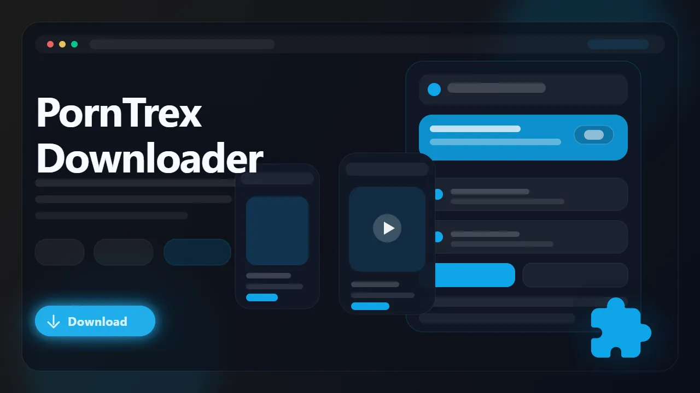

# PornTrex Downloader (Browser Extension)

> Download PornTrex videos as MP4 files directly from the watch page in your browser.

PornTrex Downloader is a browser extension built for users who want a cleaner way to save PornTrex videos for offline viewing. It detects supported video sources from PornTrex pages, lets you pick from the qualities exposed by the player, and saves finished downloads as standard MP4 files that are easy to replay later.

- Save PornTrex videos without digging through source code or network logs
- Download supported MP4 and HLS-backed video streams from watch pages
- Choose from the quality options exposed by the player
- Keep offline copies for travel, archives, or later viewing
- Use a browser-first workflow instead of command-line tools

## Links

- :rocket: Get it here: [PornTrex Downloader](https://serp.ly/porntrex-downloader)
- :new: Latest release: [GitHub Releases](https://github.com/serpapps/porntrex-downloader/releases/latest)
- :question: Help center: [SERP Help](https://help.serp.co/en/)
- :beetle: Report bugs: [GitHub Issues](https://github.com/serpapps/porntrex-downloader/issues)
- :bulb: Request features: [Feature Requests](https://github.com/serpapps/porntrex-downloader/issues)

## Preview

## Table of Contents

- [Why PornTrex Downloader](#why-porntrex-downloader)
- [Features](#features)
- [How It Works](#how-it-works)
- [Step-by-Step Tutorial: How to Download Videos from PornTrex](#step-by-step-tutorial-how-to-download-videos-from-porntrex)
- [Supported Formats](#supported-formats)
- [Who It's For](#who-its-for)
- [Common Use Cases](#common-use-cases)
- [Troubleshooting](#troubleshooting)
- [Trial & Access](#trial--access)
- [Installation Instructions](#installation-instructions)
- [FAQ](#faq)
- [License](#license)
- [Notes](#notes)
- [About PornTrex](#about-porntrex)

## Why PornTrex Downloader

PornTrex pages often expose their media through player configurations and stream URLs that are awkward to save manually. Generic downloaders can miss the real source, pull a preview instead of the main video, or fail once the page switches playback methods.

PornTrex Downloader is built to simplify that workflow. Open the watch page, let the extension detect the stream, choose the quality you want, and export the final file as MP4 without extra software.

## Features

- Detects supported PornTrex video sources from watch pages
- Multi-source detection covering flashvars, HTML5 video, and CDN monitoring
- In-page download button built into the video player
- Handles direct MP4 and supported HLS-backed playback flows
- Converts HLS streams to standard MP4 files in-browser
- Lists available quality variants when multiple resolutions exist
- Right-click context menu for quick downloads
- Saves output as MP4 for broad playback compatibility
- Auto-saves to an organized PornTrex subfolder in Downloads
- Works on Chrome, Edge, Brave, Opera, Firefox, Whale, and Yandex

## How It Works

1. Install the extension from the latest release.
2. Open a PornTrex video page and start playback.
3. Let the extension detect the active media source.
4. Open the popup or use the in-page download button on the player.
5. Review the available formats and quality options.
6. Pick the quality you want.
7. Download the video and save the MP4 locally.

## Step-by-Step Tutorial: How to Download Videos from PornTrex

1. Install PornTrex Downloader from the release page or product page.
2. Open PornTrex and navigate to the video you want to save.
3. Press play so the page loads the real media stream.
4. Click the in-page download button on the player, or open the extension popup.
5. Wait for the stream list to appear and review the available options.
6. Choose the resolution you want if more than one option is available.
7. Start the download and wait for the MP4 export to finish.
8. Open the saved file from your Downloads/PornTrex folder.

## Supported Formats

- Input: supported PornTrex watch-page video sources
- Output: MP4

Saved files use MP4 so they are easier to replay on standard media players, move between devices, or archive locally.

## Who It's For

- PornTrex viewers who want offline access
- Users archiving videos they are allowed to save
- People who want a browser tool instead of stream extraction scripts
- Users who need a simple repeatable workflow for one-off downloads
- Anyone organizing personal downloads into a cleaner local library

## Common Use Cases

- Save a PornTrex video before it disappears
- Keep a local MP4 copy for offline viewing
- Grab the highest available quality from a watch page
- Start downloads directly from the player or extension popup
- Avoid manually inspecting page scripts for media URLs

## Troubleshooting

**The extension is not detecting the video**  
Start playback first and wait a few seconds so the page loads the stream.

**The wrong source was detected**  
Refresh the page, press play again, and retry after the player fully loads.

**No quality picker is shown**
Some pages expose only one usable source. In that case, the extension uses the available stream.

**The download failed partway through**
Check your connection and refresh the page before starting again.

**The page requires account access**
The extension only works on media you can already open and play in your active browser session.

## Trial & Access

- Includes **3 free downloads** so you can test the workflow first
- Email sign-in uses secure one-time password verification
- No credit card required for the trial
- Unlimited downloads are available with a paid license

Start here: [https://serp.ly/porntrex-downloader](https://serp.ly/porntrex-downloader)

## Installation Instructions

1. Open the latest release page: [GitHub Releases](https://github.com/serpapps/porntrex-downloader/releases/latest)
2. Download the build for your browser.
3. Install the extension.
4. Open PornTrex and start a video page.
5. Use the extension popup to detect and download the media.

## FAQ

**Can I download PornTrex videos as MP4?**  
Yes. The extension exports supported videos as MP4 files.

**Do I need extra software?**  
No. The workflow runs inside the browser extension.

**Does it work on every page?**  
It works on supported watch-page playback flows. Detection depends on how the page exposes the media.

**Where are files saved?**
They are saved to your default Downloads location, typically inside a PornTrex subfolder.

**Is my data safe?**
Yes. Video processing happens entirely in your browser. Authentication uses secure OTP with no passwords stored.

## License

This repository is distributed under the proprietary SERP Apps license in the [LICENSE](LICENSE) file. Review that file before copying, modifying, or redistributing any part of this project.

## Notes

- Only download content you own or have explicit permission to save
- An internet connection is required for downloads
- Quality depends on the media source exposed by PornTrex
- Must press play before detection can begin

## About PornTrex

PornTrex is a video-hosting platform that can expose media through player configs, direct files, and stream manifests. PornTrex Downloader is meant to make supported downloads easier for users who already have browser access to that content.
